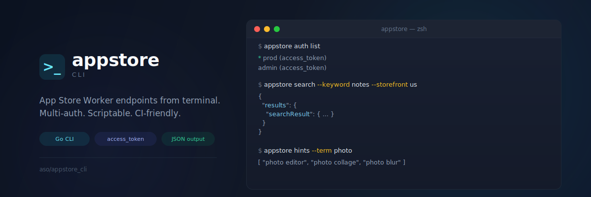

<p align="center">
  
</p>

<h1 align="center">appstore</h1>

<p align="center">
  <strong>A focused CLI for direct App Store API calls</strong><br />
  Access-token only · Multi-profile · CI-friendly · JSON-first
</p>

<p align="center">
  <a href="#-status"></a>
  <a href="#-quickstart"></a>
  <a href="#-installation"></a>
  
</p>

---

## ⚠️ Status

> **This project is in beta.** Direct endpoint calls for `search`, `hints`, and `app-details` are implemented.

---

## ✨ Why appstore?

> Query App Store endpoints directly without worker handshake/signature flow.

| | |
|---|---|
| 🔐 **Access-token only** | Uses `Authorization: Bearer <token>` |
| 👥 **Multi-profile setup** | Keep separate profiles per account/environment |
| 📊 **JSON-first output** | Easy piping to `jq`, scripts, and CI |
| ⚡ **Direct endpoints** | Calls Apple API URLs directly |

---

## 📦 Installation

<details open>
<summary><strong>Option 1 — Homebrew</strong> (recommended after first release)</summary>

```bash
brew tap FerdiKT/tap
brew install appstore
```

</details>

<details>
<summary><strong>Option 2 — Build from source</strong></summary>

```bash
cd aso/appstore_cli
go mod tidy
go build -o appstore
./appstore --help
```

</details>

---

## 🚀 Quickstart

For full auth setup details, see [`docs/AUTH_SETUP.md`](docs/AUTH_SETUP.md).

### 1️⃣ Add token profile

```bash
./appstore auth add prod --access-token '<ACCESS_TOKEN>'
```

### 2️⃣ Select active profile

```bash
./appstore auth use prod
./appstore auth list
```

### 3️⃣ Run commands

```bash
./appstore search --keyword productivity --storefront us --platform iphone
./appstore hints --term photo
./appstore app-details --app-id 1234567890 --storefront us --language en-GB --platform iphone
```

`hints` authsuz gider. İstersen auth ile denemek için: `./appstore hints --term photo --with-auth --profile prod`

---

## 🗺️ Command Map

| Group | Commands | Description |
|---|---|---|
| `auth` | `add`, `list`, `use`, `show`, `remove` | Access-token profile management |
| `search` | — | Direct call to `amp-api-search-edge ... /search` |
| `hints` | — | Direct call to iTunes hints endpoint (without Authorization by default) |
| `app-details` | — | Direct call to `amp-api-edge ... /apps` |

---

## ⚙️ Configuration

| Setting | Default |
|---|---|
| Config path | `~/.config/appstore/config.json` |
| Active profile | Last profile selected by `auth use` |

---

## 🚢 Release

Release + Homebrew automation details: [`docs/RELEASE.md`](docs/RELEASE.md)

## 📄 License

See project root license.
